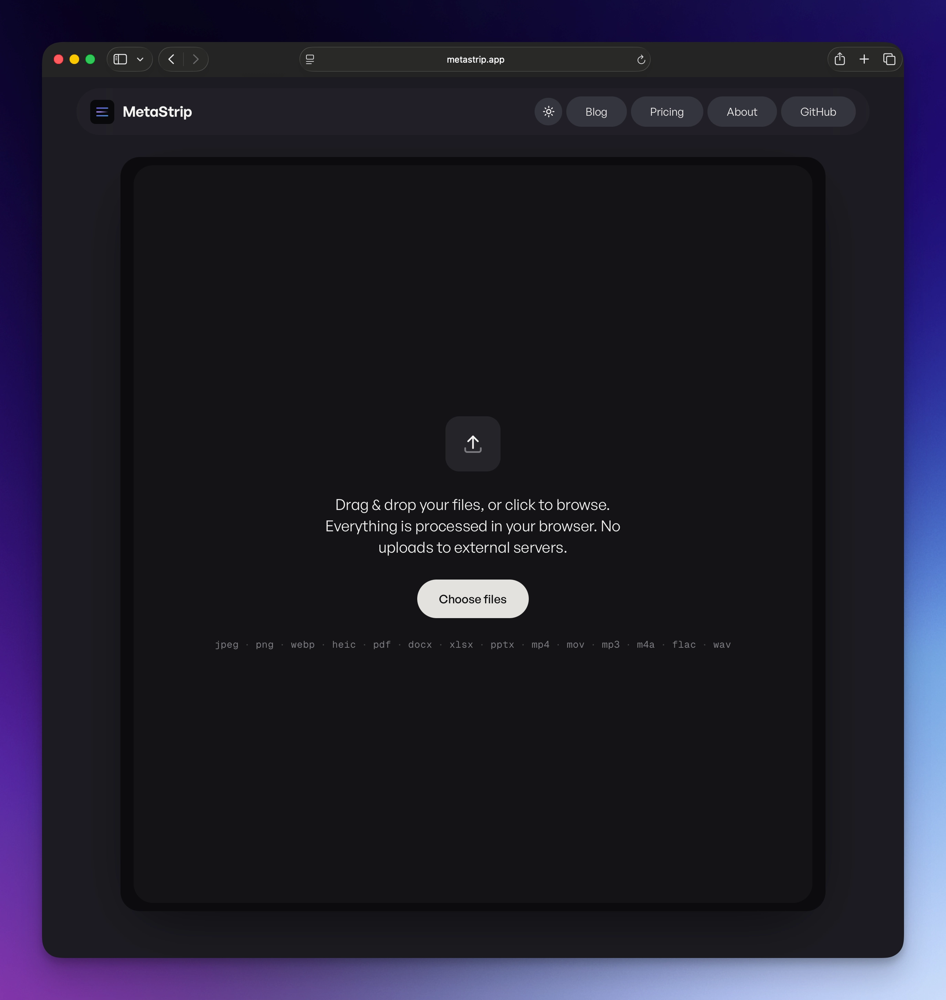
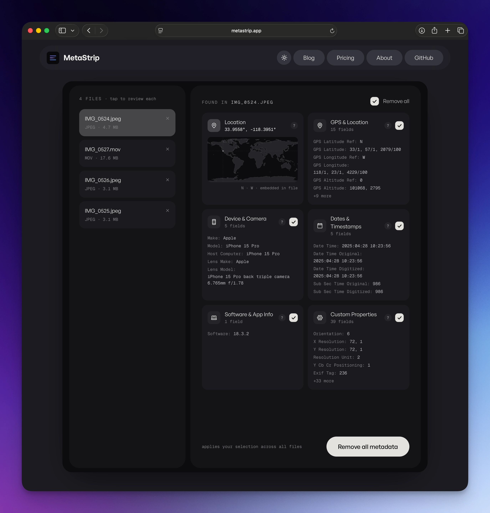

```
___  ___     _        _____ _        _       
|  \/  |    | |      /  ___| |      (_)      
| .  . | ___| |_ __ _\ `--.| |_ _ __ _ _ __  
| |\/| |/ _ \ __/ _` |`--. \ __| '__| | '_ \ 
| |  | |  __/ || (_| /\__/ / |_| |  | | |_) |
\_|  |_/\___|\__\__,_\____/ \__|_|  |_| .__/ 
                                      | |    
                                      |_|    
```

# MetaStrip

**Strip hidden metadata from photos, PDFs, Office documents, video, and audio, entirely in your browser.**

[metastrip.app](https://metastrip.app) · [@larsitodev](https://x.com/larsitodev)

<table>
  <tr>
    <td width="50%">
      
    </td>
    <td width="50%">
      
    </td>
  </tr>
</table>

---

## What it does

Photos carry GPS coordinates, device serial numbers, camera info, and timestamps. PDFs carry author names, edit history, and software fingerprints. AI-generated images carry C2PA content credentials identifying which tool made them. Videos from your phone carry GPS coordinates, device fingerprints, and per-track handler vendor IDs. Audio files carry artist tags, encoder signatures, recording-device names (ZOOM, etc.), and Broadcast Wave timestamps. MetaStrip removes all of it.

The whole tool runs client-side. Files never leave your device: there is no server, no upload, no API. You can verify it yourself: open DevTools → Network tab → drop a file → watch zero outbound requests fire.

## Why it exists

Every other "remove metadata" tool I tried wanted me to upload my files to their server, was last updated when Ubuntu still shipped with Unity, or required installing a CLI tool with a man page. None of that felt right for a privacy tool. So I built the version I actually wanted to use.

## Supported file types

| Category   | Formats                                       |
| ---------- | --------------------------------------------- |
| Images     | JPEG, PNG, WebP, HEIC, GIF                    |
| Documents  | PDF, DOCX, XLSX, PPTX                         |
| Video      | MP4, MOV, M4V                                 |
| Audio      | MP3, M4A, FLAC, WAV                           |

TIFF and additional document formats (RTF, ODT, Pages) are on the roadmap.

## What gets stripped

- **Photos**: GPS coordinates, EXIF (camera make, model, serial, settings), IPTC, XMP, C2PA content credentials, AI generation tags, embedded thumbnails, timestamps
- **PDFs**: author, creator app, producer, title, subject, keywords, custom properties, timestamps
- **GIFs**: comment extensions, the XMP packet, ICC profiles and other application blocks. The `NETSCAPE2.0` block is deliberately kept, because it carries the loop count and removing it stops animated GIFs looping.
- **Office docs**: author, last-modified-by, company, tracked changes, comments, revision history, template metadata
- **Video (MP4 / MOV / M4V)**: GPS coordinates (`©xyz`, `loci`), device make/model/software, handler vendor IDs, creation and per-track timestamps, encoder fingerprints, and tool-specific metadata in `udta` / `meta` atoms. Codec parameters are deliberately preserved so playback isn't broken.
- **Audio (MP3 / M4A / FLAC / WAV)**: ID3v1 and ID3v2 tags, Vorbis comments, embedded album art, RIFF LIST/INFO chunks, Broadcast Wave (`bext`) extensions, iXML metadata, and Pro Tools metadata blocks.

Steganographic watermarks (e.g. Google's SynthID) are pixel-level and not addressed by metadata removal, see the [blog post on AI image detection](https://metastrip.app/blog/ai-image-detection-2026-update) for a full breakdown.

## Tech

- [Next.js](https://nextjs.org) (App Router, static export)
- [piexifjs](https://github.com/hMatoba/piexifjs) for JPEG EXIF
- [pdf-lib](https://github.com/Hopding/pdf-lib) for PDF metadata
- [JSZip](https://github.com/Stuk/jszip) for DOCX / XLSX / PPTX (they're ZIP archives: unpack, modify XML, repack)
- Custom in-browser MP4 atom walker for video (MP4, MOV, M4V) replaces metadata atoms with `free` atoms of identical size so file structure stays valid
- Custom in-browser HEIC/HEIF parser. HEIC is an ISOBMFF container (same box grammar as MP4), so it reuses the same box walker; locates the EXIF/XMP items via `iloc`/`iinf` and zeroes their byte ranges in place, leaving the image items untouched (no decode, no re-encode, output stays `.heic`)
- Custom parsers for ID3v1/v2 (MP3), Vorbis comments (FLAC), and RIFF LIST/INFO + bext (WAV); FLAC PICTURE / VORBIS_COMMENT blocks are replaced with `PADDING` of equal size, RIFF chunks with `JUNK`, with no length recomputation, no risk of breaking playback
- Custom GIF block walker: metadata lives in extension blocks and nothing in a GIF points at an absolute offset, so removal is a matter of dropping whole blocks and rejoining the rest
- Shared XMP reader used by PDF, GIF and images, so an embedded packet is listed field by field (author, creator tool, document IDs) rather than as an opaque "present"
- Files are identified by their leading bytes rather than their extension, so a JPEG saved as `.png` is still stripped correctly instead of rejected
- [PostHog](https://posthog.com) for cookieless, DNT-respecting analytics
- Hosted on GitHub Pages (deployed via Actions)

No server. No tracking cookies. No accounts.

## Local development

```bash
git clone https://github.com/lars-1987/metastrip.git
cd metastrip
npm install
npm run dev
```

Then `http://localhost:3000`.

To produce a static export:

```bash
npm run build
# output: ./out/
```

## Contributing

PRs welcome, particularly:

- ~~HEIC support (the format every iPhone now defaults to)~~ · ✅ shipped Jul 2026
- ~~GIF support~~ · ✅ shipped Sep 2026
- TIFF support (also the keystone for most RAW formats, which are TIFF-based)
- Additional document formats (RTF, ODT, Pages)
- WebM / MKV / AVI video and OGG / Opus audio
- Web Worker offload so very large files don't block the main thread
- Additional metadata categories on existing formats
- Translations of the UI

Open an issue first for substantial feature work so we don't end up duplicating effort.

## License

[MIT](./LICENSE), do whatever you want with it. If you ship a fork, an attribution to the original would be appreciated but not required.

## Support

MetaStrip is free and ad-free. If it saved you time (or stopped you from leaking your home address), I'd genuinely appreciate a coffee:

[ko-fi.com/larshdev](https://ko-fi.com/larshdev)

Optional. Never required. Built in Melbourne.
